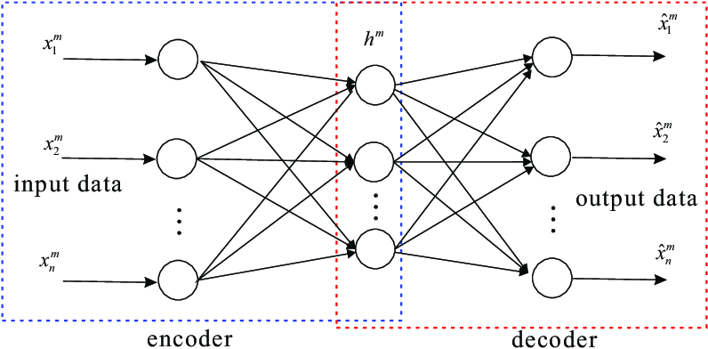

# Translating_English_Phrases_to_FRENCH_Phrases

# Summary of the algorithm

We start with input sequences from a domain (e.g. English sentences) and corresponding target sequences from another domain (e.g. French sentences).
An encoder LSTM turns input sequences to 2 state vectors (we keep the last LSTM state and discard the outputs).
A decoder LSTM is trained to turn the target sequences into the same sequence but offset by one timestep in the future, a training process called "teacher forcing" in this context. It uses as initial state the state vectors from the encoder. Effectively, the decoder learns to generate targets[t+1...] given targets[...t], conditioned on the input sequence.
In inference mode, when we want to decode unknown input sequences, we: - Encode the input sequence into state vectors - Start with a target sequence of size 1 (just the start-of-sequence character) - Feed the state vectors and 1-char target sequence to the decoder to produce predictions for the next character - Sample the next character using these predictions (we simply use argmax). - Append the sampled character to the target sequence - Repeat until we generate the end-of-sequence character or we hit the character limit

# OPERATIONS CARRIED OUT :

- FEEDING INPUT TO THE ENCODERS i.e ENGLISH WORDS

- GENERATING CONTEXT VECTOR

- DECODING THE ENGLISH PHRASES INTO FRENCH WORDS.

- BULIDNING AND SAVING THE MODEL. ETC..
